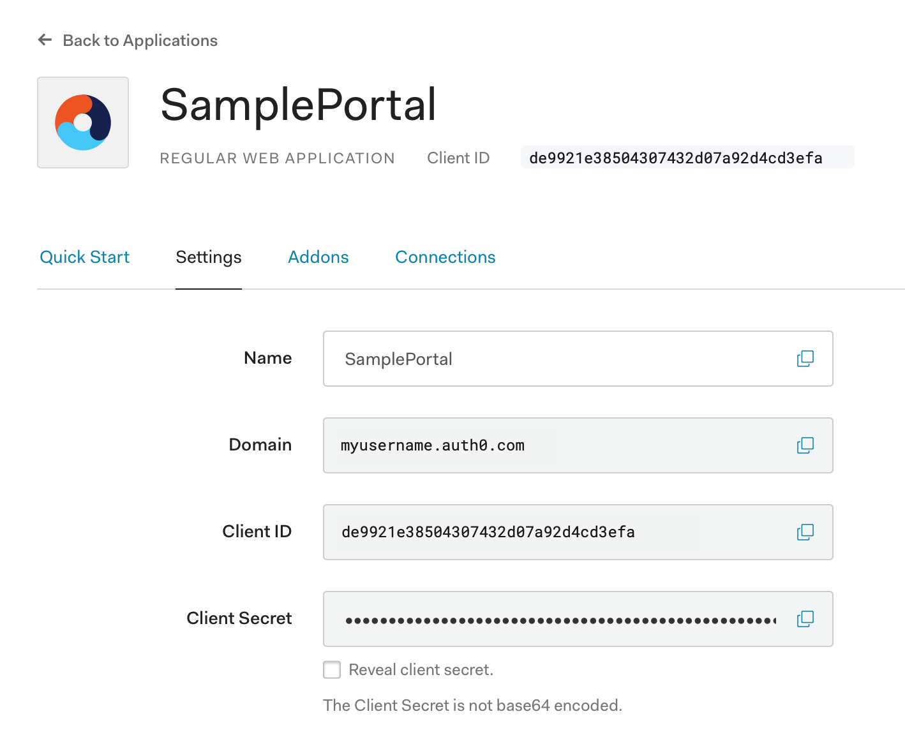

# Federated Login with Auth0

## Auth0 Setup

We need to start by creating a regular web application so Auth0 can identify us.  Go to the Applications menu from the side-bar on your Auth0 Dashboard.

Select '+ Create Application'.  Provide a name for your app and select 'Regular Web Applications'.  Then select 'Create'.

Go to the 'Settings' tab for your application to find your Domain, Client ID, and Client Secret.

You'll want to configure this is a "Regular Web Application" using "POST" for the Token Endpoint Authentication Method.

Be sure to configure the proper settings for:
 - Allowed Callback URLs
 - Application Login URI
 - Allowed Web Origins
 - Allowed Logout URLs

If testing on your local system, you can start with the following settings:

 - Allowed Callback URLs:
    - http://localhost:8080/login/callback, https://localhost/login/callback, https://127.0.0.1/login/callback
 - Application Login URI:
    - https://127.0.0.1/login
 - Allowed Web Origins:
    - http://localhost:8080/, https://localhost/, https://127.0.0.1/
 - Allowed Logout URLs:
    - http://localhost:8080/, https://localhost/, https://127.0.0.1/

This provides you with an OAuth Client ID and secret you can provide to Imperial.

## Imperial Integration

You can use Auth0 with the `ImperialAuth0` package. This expects three environment variables:

* `AUTH0_DOMAIN`
* `AUTH0_CLIENT_ID`
* `AUTH0_CLIENT_SECRET`

You can then register the OAuth provider like normal.

### References

Some potentially useful references:

* [Auth0 Login Using Authorization Code Flow](https://auth0.com/docs/flows/guides/auth-code/add-login-auth-code)
* [Auth0 Troubleshooting Guide](https://auth0.com/docs/troubleshoot/guides/check-login-logout-issues)
* [nginx full example configuration](https://www.nginx.com/resources/wiki/start/topics/examples/full/)
