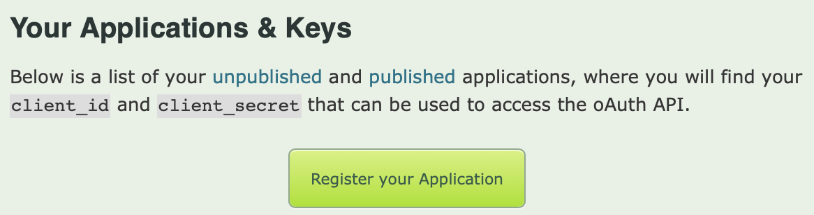
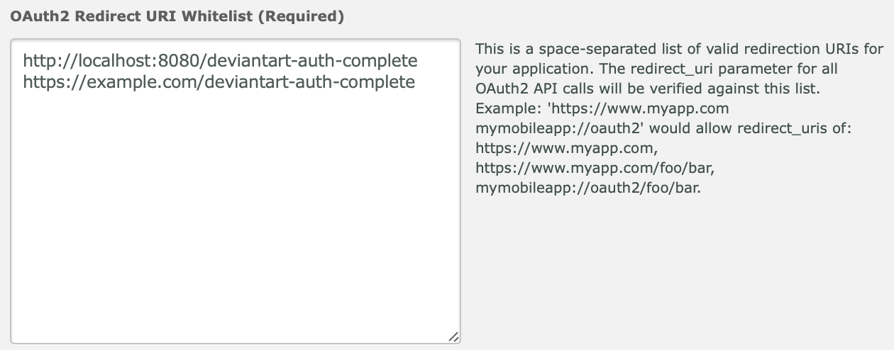

# Federated Login with DeviantArt

## DeviantArt Setup

Start by going to the [DeviantArt developers page](https://www.deviantart.com/developers/). Click the 'Register your Application' button.

Fill in the app information, particularly the OAuth2 Redirect URI Whitelist:

This provides you with an OAuth Client ID and secret you can provide to Imperial.

## Imperial Integration

You can use DeviantArt with the `ImperialDeviantArt` package. This expects two environment variables:

* `DEVIANT_CLIENT_ID`
* `DEVIANT_CLIENT_SECRET`

You can then register the OAuth provider like normal.
