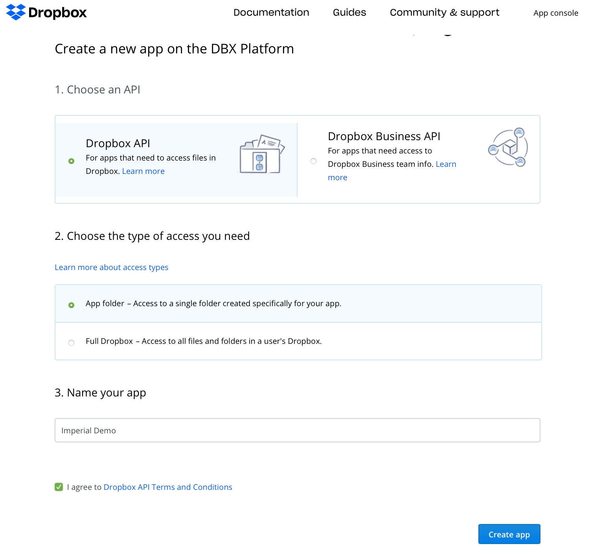
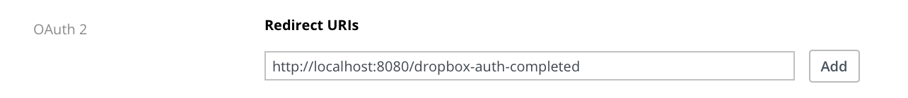

# Federated Login with Dropbox

## Dropbox Setup

Start by going to the [Dropbox App console page](https://dropbox.com/developers/apps/). Click the 'Create App' button. Choose your API, access type, and name, then click 'Create App':

Fill in the rest of the app information, particularly the Redirect URIs:

This provides you with an OAuth Client ID and secret you can provide to Imperial.

## Imperial Integration

You can use Dropbox with the `ImperialDropbox` package. This expects two environment variables:

* `DROPBOX_CLIENT_ID`
* `DROPBOX_CLIENT_SECRET`

You can then register the OAuth provider like normal.
