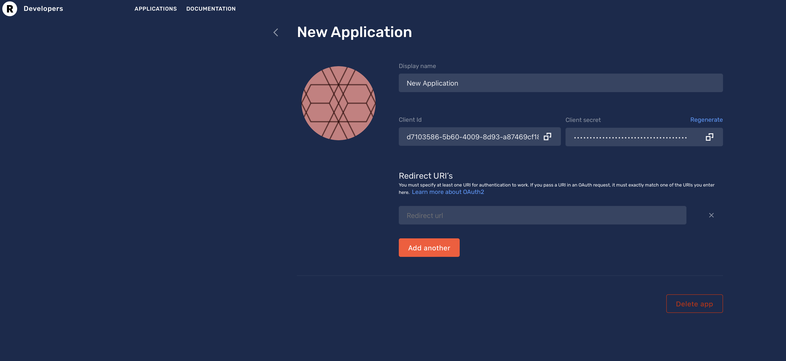

# Federated Login with Restream

We need to start by creating a client ID and secret so Restream can identify us. Go to the [Restream Developer Portal](https://developers.restream.io/).

Select 'Create App':

Fill in the necessary details for your application and create it. Under the 'Settings' section, in 'Redirect URIs', you will need to add a URI for Restream to redirect to after the authentication is complete. If you are developing locally, it will be `http://localhost:8080/auth/restream/callback` or `https...` if you have configured SSL:

This provides you with an OAuth Client ID and secret you can provide to Imperial.

## Imperial Integration

You can use Restream with the `ImperialRestream` package. This expects two environment variables:

* `RESTREAM_CLIENT_ID`
* `RESTREAM_CLIENT_SECRET`

You can then register the OAuth provider like normal.

[1]: https://developers.restream.io/docs